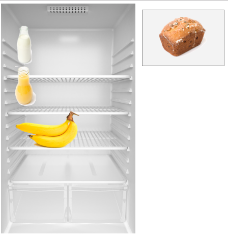
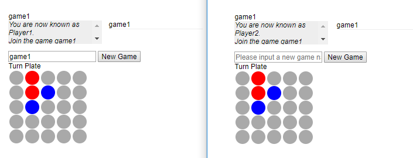
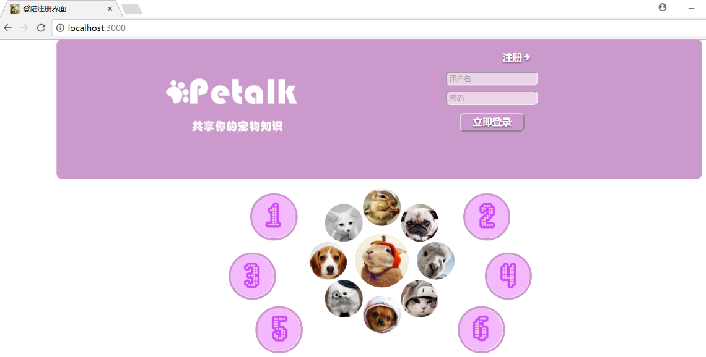
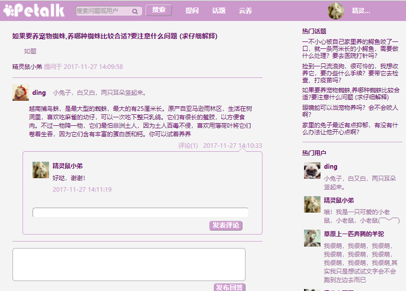
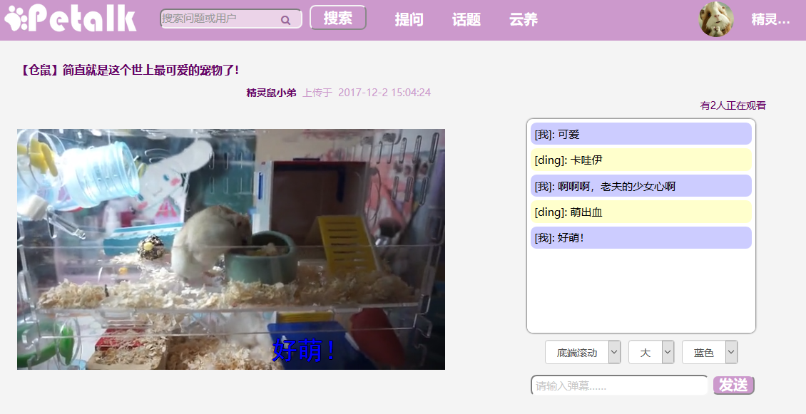

# ModernWeb

A project for course ModernWeb.

## MeteorDemo:
A demo from Book _Meteor in Action_


## NodeDemo:
A demo of Turn Plate Game, the player who turn all the plates to his color wins.
Just to show the Socket.IO framework.


## Petalk:
A web for pet owners to Q&A.
First finished by JSP and Servlet.
Now reconstruct by Node.js.






(add videos under Petalk/public/video)

More details for this project: https://blog.csdn.net/Blanchedingding/article/details/80150448

## Petalk-docker:
Run the Petalk project with docker-compose

First: 
```
cd Petalk-docker/petalk-service
npm install
```

Then, 
```
cd Petalk-docker
docker-compose build
docker-compose up
```

(Also add videos under Petalk/public/video)
